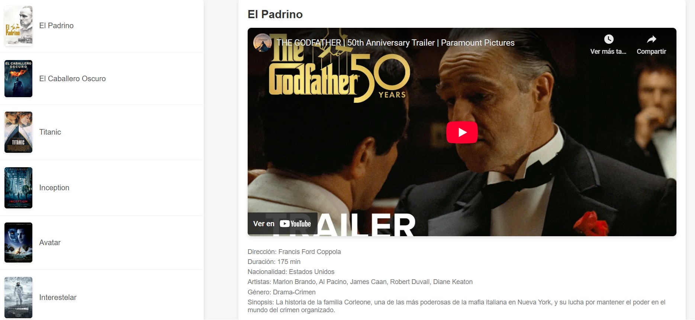
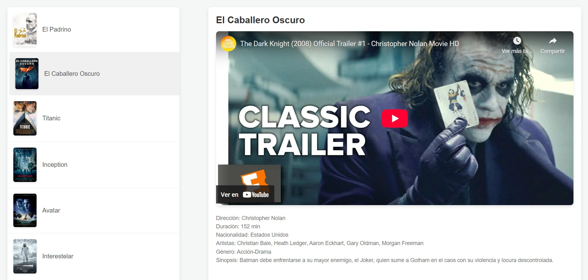

# 🎥 Cartelera AJAX

> Un proyecto de cartelera de películas con AJAX donde puedes ver los pósters de las películas y, al hacer clic en ellos, ver el tráiler en YouTube.

## 📌 Tecnologías Usadas

- 🖥 **HTML** → Estructura de la página web.
- 🎨 **CSS** → Estilos y diseño de la interfaz.
- ⚡ **JavaScript (AJAX)** → Carga dinámica de contenido sin recargar la página.
- 🗄 **XML** → Almacena la información de las películas.

---

## 🚀 Cómo Funciona

1. La página carga los pósters de las películas desde un archivo **XML**.
2. Cuando el usuario hace clic en un póster, se obtiene la URL del tráiler desde el XML.
3. Se muestra el tráiler dentro de la página.
4. Si quieres añadir más películas, solo debes editar el archivo **XML**.

---

## 📸 Capturas de Pantalla

### 📺 Vista Principal


### 📽️ Visualización de cambio de película


---

## 👅 Instalación y Uso

### 🔹 Clonar el Repositorio
```sh
git clone https://github.com/Avalob/cartelera-ayax.git
```

### 🔹 Abrir el Proyecto
1. Abre el archivo `index.html` en tu navegador.
2. Asegúrate de que el archivo `cartelera.xml` está en la misma carpeta.
3. Disfruta navegando por la cartelera. 🎮

---

## 📝 Añadir una Nueva Película
Para agregar una película nueva, edita el archivo **XML** y añade un nuevo elemento con esta estructura:

```xml
<pelicula>
    <titulo>Nueva Película</titulo>
    <imagen>imagenes/nueva-pelicula.jpg</imagen>
    <trailer>https://www.youtube.com/embed/ID_DEL_VIDEO</trailer>
</pelicula>
```

Guarda los cambios y actualiza la página. 🚀

---

¡Disfruta del proyecto! 🍿🎥

